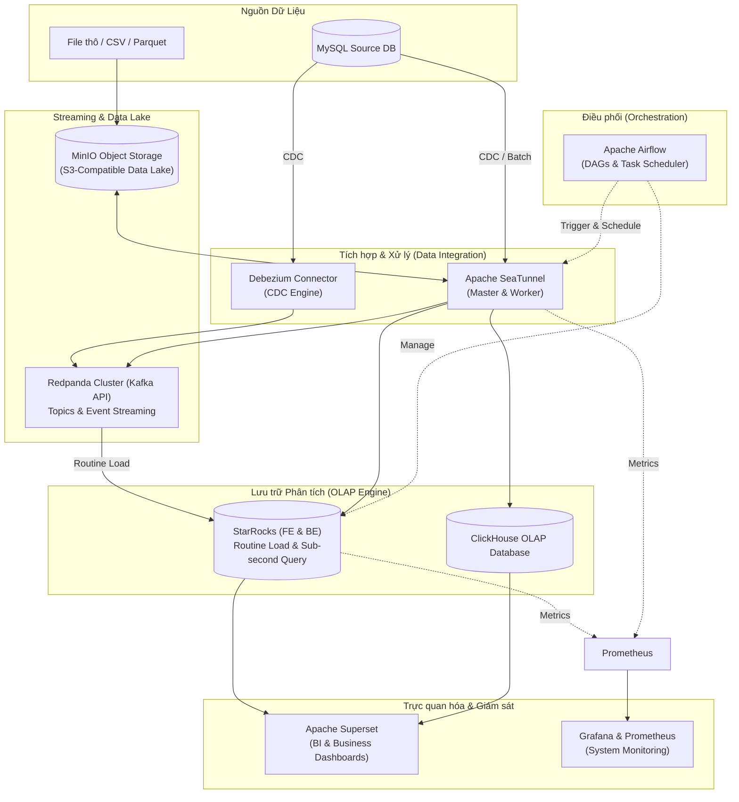

# 🚀 Modern Real-time Data Platform & Dashboard Stack

Hệ sinh thái nền tảng dữ liệu hiện đại (**Modern Data Stack**) toàn diện phục vụ việc thu thập, xử lý theo thời gian thực (Real-time Streaming), tích hợp dữ liệu (ETL/ELT), lưu trữ phân tích tốc độ cao (OLAP) và trực quan hóa dữ liệu (BI Dashboard).

---

## 📑 Mục lục
- [Kiến trúc hệ thống](#-kiến-trúc-hệ-thống)
- [Các thành phần chính](#-các-thành-phần-chính)
- [Cấu trúc thư mục](#-cấu-trúc-thư-mục)
- [Yêu cầu hệ thống](#-yêu-cầu-hệ-thống)
- [Hướng dẫn cài đặt & Khởi chạy](#-hướng-dẫn-cài-đặt--khởi-chạy)
- [Quy trình luồng dữ liệu (End-to-End Pipeline)](#-quy-trình-luồng-dữ-liệu-end-to-end-pipeline)
- [Bảng cổng truy cập & Tài khoản mặc định](#-bảng-cổng-truy-cập--tài-khoản-mặc-định)
- [Hướng dẫn đẩy code lên GitHub](#-hướng-dẫn-đẩy-code-lên-github)

---

## 🏗 Kiến trúc hệ thống



---

## 🧩 Các thành phần chính

| Thành phần | Công nghệ | Mô tả vai trò |
| :--- | :--- | :--- |
| **Event Streaming** | **Redpanda** | Nền tảng Streaming tương thích Kafka viết bằng C++, hiệu năng cao, độ trễ cực thấp. Hỗ trợ Kafka Connect & Debezium CDC. |
| **Data Lake** | **MinIO** | Lưu trữ đối tượng phân tán chuẩn S3 API, đóng vai trò Data Lake lưu trữ dữ liệu thô, backup và checkpoint. |
| **Data Integration** | **Apache SeaTunnel** | Động cơ tích hợp dữ liệu thế hệ mới siêu tốc, hỗ trợ đồng bộ dữ liệu đa nguồn (MySQL, Kafka, StarRocks, ClickHouse,...). |
| **OLAP Database** | **StarRocks** | Cơ sở dữ liệu phân tích MPP thế hệ mới, hỗ trợ cơ chế **Routine Load** tự động lấy dữ liệu từ Redpanda/Kafka với tốc độ truy vấn sub-second. |
| **OLAP Database** | **ClickHouse** | Cơ sở dữ liệu cột tối ưu hóa cho các truy vấn phân tích, tổng hợp số liệu lớn theo thời gian thực. |
| **Orchestration** | **Apache Airflow** | Quản lý, điều phối và lập lịch các luồng dữ liệu (Data Pipelines / DAGs) tự động. |
| **BI & Analytics** | **Apache Superset** | Nền tảng Business Intelligence mạnh mẽ để tạo biểu đồ, báo cáo và dashboard tương tác. |
| **Monitoring** | **Grafana + Prometheus** | Giám sát hiệu năng hệ thống, metrics của cụm SeaTunnel và StarRocks. |

---

## 📁 Cấu trúc thư mục

```text
dashboard-stack/
├── airflow/                      # Docker Compose & cấu hình Apache Airflow
├── clickouse/                    # Docker Compose & cấu hình ClickHouse XML
├── minio/                        # Docker Compose & cấu hình MinIO Object Storage
├── redpanda/                     # Cụm 3 node Redpanda, Kafka Connect & Debezium
│   ├── debezium-connector-starrocks/
│   └── kafka-connect-transform-common/
├── starrocks-seatunnel/          # StarRocks (FE, BE), SeaTunnel, Prometheus, Grafana
│   ├── jobs/                     # Các file cấu hình SeaTunnel Job (.conf)
│   ├── grafana-dashboard.json    # Template dashboard Grafana
│   ├── prometheus.yml            # Config cào metrics Prometheus
│   └── seatunnel.yaml            # Cấu hình SeaTunnel Engine
├── superset/                     # Docker Compose & cấu hình Apache Superset
│   ├── assets/                   # Logo, hình ảnh, tài nguyên giao diện
│   └── docker/                   # Script khởi tạo, bootstrap cho Superset
├── create_view_in_supperset/     # Script Python tạo SQL Views phân tích trong StarRocks
├── .gitignore                    # Cấu hình bỏ qua file nhạy cảm & dữ liệu nặng
└── README.md                     # Tài liệu hướng dẫn dự án
```

---

## 💻 Yêu cầu hệ thống

- **Hệ điều hành:** Windows 10/11 (WSL2), macOS, hoặc Linux
- **Docker:** Docker Desktop hoặc Docker Engine version `>= 24.0`
- **Docker Compose:** version `>= 2.20`
- **Phần cứng khuyến nghị:**
  - **RAM:** Tối thiểu 16 GB (khuyến nghị 24 GB - 32 GB để chạy đồng thời tất cả các stack)
  - **CPU:** Tối thiểu 4 Cores (khuyến nghị 8 Cores)
  - **Ổ cứng trống:** Tối thiểu 30 GB SSD

---

## ⚡ Hướng dẫn cài đặt & Khởi chạy

### Bước 1: Sao chép các file môi trường `.env`

Trước khi khởi chạy, hãy tạo các file `.env` từ file mẫu `.example.env`:

**Trên Windows (PowerShell):**
```powershell
copy .\airflow\.example.env .\airflow\.env
copy .\clickouse\.example.env .\clickouse\.env
copy .\minio\.example.env .\minio\.env
copy .\redpanda\.example.env .\redpanda\.env
copy .\superset\docker\.example.env .\superset\docker\.env
```

**Trên Linux / macOS (Bash):**
```bash
cp airflow/.example.env airflow/.env
cp clickouse/.example.env clickouse/.env
cp minio/.example.env minio/.env
cp redpanda/.example.env redpanda/.env
cp superset/docker/.example.env superset/docker/.env
```

> 💡 *Lưu ý: Mở các file `.env` để kiểm tra IP máy Host (`KAFKA_HOST_IP`, `host.docker.internal`) và mật khẩu phù hợp với máy của bạn.*

---

### Bước 2: Khởi chạy các dịch vụ theo thứ tự

Khởi chạy từng thành phần theo thứ tự được khuyến nghị:

#### 1. Khởi chạy MinIO (Data Lake)
```bash
cd minio
docker compose up -d
cd ..
```

#### 2. Khởi chạy ClickHouse (OLAP Database)
```bash
cd clickouse
docker compose up -d
cd ..
```

#### 3. Khởi chạy Cụm Redpanda (Event Streaming)
```bash
cd redpanda
docker compose up -d
cd ..
```

#### 4. Khởi chạy StarRocks & SeaTunnel (OLAP & Tích hợp)
```bash
cd starrocks-seatunnel
docker compose up -d
cd ..
```

#### 5. Khởi chạy Apache Airflow (Điều phối Workflow)
```bash
cd airflow
docker compose up -d
cd ..
```

#### 6. Khởi chạy Apache Superset (BI Dashboard)
```bash
cd superset
docker compose up -d
cd ..
```

---

## 🔄 Quy trình luồng dữ liệu (End-to-End Pipeline)

### 1. Đồng bộ dữ liệu vào Redpanda bằng SeaTunnel
Chạy lệnh bên trong container `seatunnel-master` để đồng bộ dữ liệu từ nguồn vào Redpanda topic:
```bash
docker exec -it seatunnel-master /opt/seatunnel/bin/seatunnel.sh --config /opt/seatunnel/jobs/jobs_data1/mysql-to-redpanda-customers.conf
```

### 2. Tạo Database & Bảng trong StarRocks
Kết nối vào StarRocks qua MySQL CLI:
```bash
docker exec -it starrocks-fe mysql -h 127.0.0.1 -P 9030 -u root
```

Chạy script tạo database và bảng phân tích:
```sql
CREATE DATABASE IF NOT EXISTS ecommerce_olap;
USE ecommerce_olap;

CREATE TABLE IF NOT EXISTS df_customers (
    customer_id     INT          NOT NULL COMMENT "Mã khách hàng",
    customer_zip_code_prefix VARCHAR(50),
    customer_city   VARCHAR(255),
    customer_state  VARCHAR(50)
)
PRIMARY KEY (customer_id)
DISTRIBUTED BY HASH(customer_id) BUCKETS 4
PROPERTIES ("replication_num" = "1");
```

### 3. Thiết lập Routine Load (Tự động nạp dữ liệu từ Redpanda vào StarRocks)
```sql
USE ecommerce_olap;

CREATE ROUTINE LOAD ecommerce_olap.load_customers ON df_customers
PROPERTIES (
    "format" = "json",
    "jsonpaths" = "[\"$.customer_id\", \"$.customer_zip_code_prefix\", \"$.customer_city\", \"$.customer_state\"]"
)
FROM KAFKA (
    "kafka_broker_list" = "host.docker.internal:19092",
    "kafka_topic" = "ecommerce_db.df_customers",
    "kafka_partitions" = "0",
    "kafka_offsets" = "OFFSET_BEGINNING"
);
```

Kiểm tra trạng thái Routine Load:
```sql
SHOW ROUTINE LOAD FROM ecommerce_olap\G
SELECT COUNT(*) FROM ecommerce_olap.df_customers;
```

### 4. Tạo các Views phân tích cho Superset
Chạy file Python tự động tạo view phân tích:
```bash
python create_view_in_supperset/create_data1.py
```

---

## 🌐 Bảng cổng truy cập & Tài khoản mặc định

| Dịch vụ | Địa chỉ Web UI / Port | Tài khoản mặc định | Mật khẩu mặc định |
| :--- | :--- | :--- | :--- |
| **Apache Superset** | [http://localhost:18088](http://localhost:18088) | `admin` | `admin` |
| **Apache Airflow** | [http://localhost:8080](http://localhost:8080) | `airflow` | `airflow` |
| **Redpanda Console** | [http://localhost:8086](http://localhost:8086) | *(Không yêu cầu)* | - |
| **MinIO Console** | [http://localhost:19011](http://localhost:19011) | `minio` | `minio` |
| **MinIO S3 API** | `http://localhost:19010` | - | - |
| **Grafana Dashboard** | [http://localhost:3000](http://localhost:3000) | `admin` | `grafana` |
| **Prometheus Metrics** | [http://localhost:9090](http://localhost:9090) | *(Không yêu cầu)* | - |
| **StarRocks (MySQL Port)** | `localhost:9030` | `root` | *(Trống)* |
| **ClickHouse HTTP / TCP** | `localhost:18123` / `19000` | `default` | *(Theo .env)* |

---

## 📤 Hướng dẫn đẩy code lên GitHub

Dưới đây là các bước chi tiết để đưa toàn bộ mã nguồn của bạn lên GitHub:

### Bước 1: Tạo Repository mới trên GitHub
1. Đăng nhập vào tài khoản [GitHub](https://github.com).
2. Nhấn nút **New** (hoặc dấu `+` ở góc trên cùng bên phải -> chọn **New repository**).
3. Đặt tên Repository (ví dụ: `modern-data-platform` hoặc `dashboard-stack`).
4. Chọn **Public** hoặc **Private** tùy nhu cầu.
5. **LƯU Ý:** Không tích chọn *"Initialize this repository with a README"*, *.gitignore*, hoặc *license* (vì dự án đã có sẵn các file này).
6. Nhấn **Create repository**.
7. Sao chép đường link URL của repository (ví dụ: `https://github.com/<your-username>/<your-repo-name>.git`).

---

### Bước 2: Cấu hình Git & Commit mã nguồn

Mở Terminal / PowerShell tại thư mục gốc của dự án (`d:\dashboard-stack-maintest`) và thực hiện các lệnh sau:

```bash
# 1. Khởi tạo Git (nếu chưa khởi tạo)
git init

# 2. Cấu hình thông tin tác giả (nếu chưa cấu hình)
git config --global user.name "Tên Của Bạn"
git config --global user.email "email_cua_ban@example.com"

# 3. Thêm tất cả các file vào Git Staging
git add .

# 4. Tạo commit đầu tiên
git commit -m "feat: initial commit for modern data platform dashboard stack"
```

---

### Bước 3: Liên kết với Remote GitHub & Push Code

```bash
# 1. Đổi tên branch chính thành 'main' (chuẩn của GitHub)
git branch -M main

# 2. Thêm remote origin trỏ đến repository GitHub vừa tạo
git remote add origin https://github.com/<your-username>/<your-repo-name>.git

# 3. Đẩy code lên nhánh main
git push -u origin main
```

*(Khi chạy lệnh `git push`, trình duyệt hoặc terminal sẽ yêu cầu đăng nhập GitHub hoặc nhập Personal Access Token của bạn).*

---

### 🔄 Các lần cập nhật code tiếp theo

Mỗi khi bạn sửa đổi hoặc thêm code mới, chỉ cần chạy 3 lệnh đơn giản sau:

```bash
git add .
git commit -m "Mô tả nội dung bạn vừa sửa đổi"
git push
```

---

## 📄 License
Dự án được phân phối dưới giấy phép mã nguồn mở hoặc nội bộ của tổ chức. Vui lòng tham khảo tài liệu nội bộ trước khi sử dụng trong môi trường Production.
